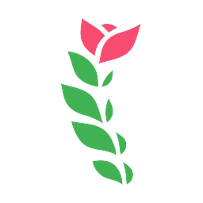
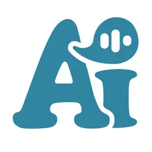
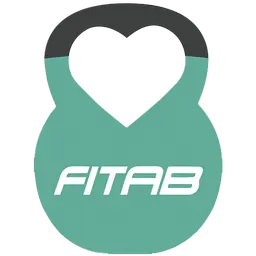
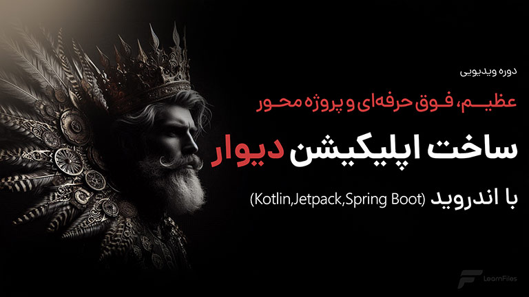

  # Hi there, I'm [Mahdi Asadollahpour](https://github.com/mahdiasd) 👋
  
  

  

    <b>Senior Android & Cross-Platform Mobile Engineer</b> based in Iran 🇮🇷 
    Specializing in high-performance, modular mobile applications with <b>Kotlin, Jetpack Compose, and Flutter</b>.
  

  

    
    
    
    
  

---

### 👨‍💻 About Me

I am an accomplished **Mobile Application Engineer** with **6+ years** of hands-on experience designing, developing, and deploying robust, scalable, and user-centric applications. Starting my journey with native **Java**, I progressed to **Kotlin, Jetpack Compose**, and **Flutter**, adopting modern engineering standards.

- 📱 **Mobile Specialization:** Native Android (Kotlin, Jetpack Compose, Coroutines, Flow) and Cross-Platform (Flutter for Android, iOS & Web).
- 🏗️ **Architecture & Code Quality:** Staunch advocate of **Clean Architecture**, **MVI/MVVM**, and **Multi-Module separation** for testability, scalability, and maintainability.
- 🛡️ **Defense & Industrial R&D:** Engineered mission-critical secure applications and **smart-glass (wearable HUD)** systems for industrial inspection environments in a high-tech knowledge-based company.
- 🎓 **Technical Instructor:** Author of comprehensive full-stack mobile development curricula at **Learnfiles**, mentoring developers in building enterprise-grade apps from scratch to production.

---

### 🛠️ Tech Stack & Skills

| Domain | Technologies & Frameworks |
| :--- | :--- |
| **Languages** |     |
| **Mobile & UI** |     |
| **Architecture** | `Clean Architecture` `MVI` `MVVM` `Multi-Module Architecture` `Repository Pattern` `SOLID Principles` |
| **Async & Reactive** |  `StateFlow / SharedFlow` `Kotlin Flow` `WorkManager` |
| **Dependency Injection** |   `Dagger 2` |
| **Backend & APIs** |   `WebRTC` `WebSocket` `RESTful APIs` `Retrofit` |
| **Databases & Cache** |   `Room Database` `DataStore` `SQLite` |
| **Hardware & Media** | `ExoPlayer / Media3` `CameraX` `Smart-Glass HUDs` `Sensors Telemetry` `OpenStreetMap (OSM)` `Google Maps API` |
| **Tools & DevOps** |     |

---

### 🚀 Featured Products & Commercial Applications

<table>
  <tr>
    <td width="100" align="center" valign="middle">
      
    </td>
    <td>
      <h3 style="margin: 0;">Rose Physio HUB</h3>
      

        
        
        
      

      

        A comprehensive digital tele-rehabilitation and clinic management platform. Developed the client-side ecosystem (Web application alongside cross-platform Android and iOS mobile apps) using <b>Flutter</b>. Features seamless cross-device synchronization, exercise guidance, real-time consultation management, and clinical telemetry.
      

      

        🔗 <a href="https://rosephysiohub.com/"><b>Visit Live Platform (rosephysiohub.com)</b></a>
      

    </td>
  </tr>
  <tr>
    <td width="100" align="center" valign="middle">
      
    </td>
    <td>
      <h3 style="margin: 0;">AI Speaking</h3>
      

        
        
        
      

      

        An intelligent English language learning and conversational tutor app. Built natively using <b>Kotlin</b> and <b>Jetpack Compose</b> with <b>Clean Architecture</b>. Implements real-time audio capture, phoneme accuracy scoring, dynamic interactive conversations, and smart feedback mechanisms powered by AI voice processing models.
      

      

        📲 <a href="https://cafebazaar.ir/app/ir.aispeaking"><b>View on CafeBazaar</b></a>
      

    </td>
  </tr>
  <tr>
    <td width="100" align="center" valign="middle">
      
    </td>
    <td>
      <h3 style="margin: 0;">Fitab (فیتب)</h3>
      

        
        
        
      

      

        A video-on-demand fitness and home workout application. Engineered customized workout tracking, responsive video streaming pipelines powered by <b>ExoPlayer</b>, local progress caching using <b>Room Database</b>, and a smooth UI tailored for fitness enthusiasts.
      

      

        📲 <a href="https://cafebazaar.ir/app/ir.manshor.video.fitab"><b>View on CafeBazaar</b></a>
      

    </td>
  </tr>
</table>

---

### 🎓 Teaching & Technical Instruction

  

 

**Course:** [Comprehensive Project-Based Course: Building Divar with Android](https://learnfiles.com/course/%d8%a2%d9%85%d9%88%d8%b2%d8%b4-%d8%b3%d8%a7%d8%ae%d8%aa-%d8%a7%d9%be%db%8c%d9%84%db%8c%da%a9%db%8c%d8%b4%d9%86-%d8%af%db%8c%d9%88%d8%a7%d8%b1-%d8%a8%d8%a7-%d8%a7%d9%86%d8%af%d8%b1%d9%88%db%8c%d8%af/)  
**Academy:** [Learnfiles.com](https://learnfiles.com) | **Instructor:** [Mahdi Asadollahpour](https://learnfiles.com/instructor/AsadolapourMahdi/)

- **Full-Stack Mobile Architecture:** Instructed developers on building a production-ready classified ads marketplace (Divar clone) from scratch.
- **Modern Client Stack:** Fully developed with **Kotlin**, **Jetpack Compose**, **Clean Architecture**, **MVI pattern**, Coroutines, StateFlow, and Jetpack Hilt.
- **Backend Architecture:** Guided the design and implementation of a scalable backend using **Spring Boot**, **Kotlin**, and relational databases.
- **Production Engineering:** Covered multi-module structure, offline caching, modular navigation, real-time state management, and deployment standards.

---

### 🛡️ Specialized Engineering & R&D Work

- **Smart-Glass & AR Wearable HUDs:** During my service in an elite knowledge-based tech enterprise, contributed to custom Android systems powering industrial smart glasses and heads-up displays (HUDs).
- **Mission-Critical Real-Time Streaming:** Built secure, low-latency audio/video transmission channels leveraging **WebRTC** and **WebSockets** designed to function reliably in harsh network and industrial settings.
- **Hardware Integration & Enterprise Security:** Interfaced directly with onboard sensors (inertial sensors, camera feeds, telemetry), strictly enforcing security hardening and encrypted storage protocols.

---

### 📊 GitHub Activity & Metrics

  
  

  

---

### 📫 Let's Connect & Collaborate

  
  
  

---

  💡 <i>"While I don’t claim to know it all, I am relentlessly committed to continuous learning, engineering discipline, and building software that delivers genuine value."</i>

